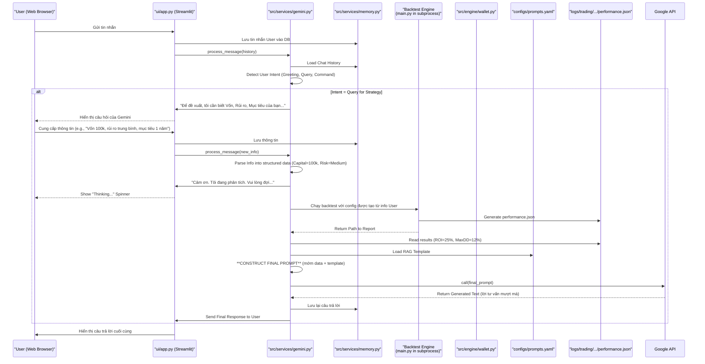

---

### **ALPHAQUANTAGENT: BẢN THIẾT KẾ KỸ THUẬT TỐI THƯỢNG**
**(THE ULTIMATE TECHNICAL BLUEPRINT)**

---

### **PHẦN V/VII: DÒNG CHẢY HỆ THỐNG & SƠ ĐỒ TƯƠN GÁC CHI TIẾT**

Phần này sẽ trình bày **Sơ đồ Tuần tự (Sequence Diagram)** chi tiết cho 3 kịch bản vận hành cốt lõi của hệ thống: Huấn luyện (Training), Kiểm thử lại (Backtesting), và Tương tác Người dùng (Live Interaction).

#### **5.1. Kịch bản 1: Huấn luyện Agent Giao dịch (Training Flow)**

**Mục tiêu:** Tạo ra một "Chiến binh" RL (`trader.py`) có khả năng tự đưa ra quyết định giao dịch tối ưu.

**Trigger:** `python main.py --mode train`

**Sơ đồ Tương tác Tuần tự (Sequence Diagram):**

```mermaid
sequenceDiagram
    participant CLI as "Terminal (main.py)"
    participant C as "configs/*.yaml"
    participant M as "src/engine/market.py"
    participant W as "src/engine/wallet.py"
    participant S as "src/engine/simulator.py <br/> (RL Environment)"
    participant T as "src/agents/trader.py"
    participant Logs as "logs/training/*"
    participant Models as "models/rl_agent/*"

    CLI->>C: Load Hyperparameters
    CLI->>M: Load All Data (ETL)
    M-->>CLI: Tensor Ready

    CLI->>S: Instantiate Env (with Market & Wallet)
    CLI->>T: Instantiate PPO Agent (with Env & Hyperparams)
    T->>Logs: Setup TensorBoard Logger

    loop Training Loop (e.g., 1,000,000 timesteps)
        S->>M: get_state_window()
        S->>W: get_metrics() / mark_to_market()
        
        S-->>T: Pass Observation (State)
        
        T->>T: actor_network.forward(state)
        T-->>S: Return Action (Buy/Sell/Hold)
        
        S->>S: Interpret Action (e.g., Buy 0.5 BTC)
        S->>M: get_execution_context() (Prices, Events, Metadata)
        S->>W: execute(order) with Market Context

        alt Order Filled
            W-->>S: Return (True, "FILLED")
        else Order Rejected (Locked/No Cash)
            W-->>S: Return (False, "LOCKED")
        end
        
        S->>S: Calculate Reward (PnL Change, Sharpe Ratio, etc.)
        S->>S: Check if Done (End of Timeline / Bankrupt)

        S-->>T: Return (New Observation, Reward, Done, Info)
        T->>T: Store Experience in Buffer
        
        opt Buffer is Full
            T->>T: Update Policy (Gradient Descent)
            T->>Logs: Log Metrics (Loss, Reward) to TensorBoard
        end

        opt Checkpoint Trigger
            T->>Models: Save Checkpoint (trader.zip)
        end
    end

    CLI->>Models: Save Best Model
```*   **Điểm then chốt:** Vòng lặp này mô phỏng hàng nghìn "cuộc đời" của một nhà giao dịch. `Simulator` đóng vai "Chúa", điều khiển thời gian và môi trường. `Trader` là người chơi, cố gắng học luật chơi để tối đa hóa điểm số (`Reward`). `Market` là thế giới thực. `Wallet` là bảng điểm và túi tiền.

#### **5.2. Kịch bản 2: Kiểm thử lại Chiến lược (Backtesting Flow)**

**Mục tiêu:** Đánh giá hiệu suất của Agent đã được huấn luyện trên một khoảng thời gian lịch sử cụ thể.

**Trigger:** `python main.py --mode backtest --start-date YYYY-MM-DD`

**Sơ đồ Tương tác Tuần tự:**

```mermaid
sequenceDiagram
    participant CLI as "Terminal (main.py)"
    participant C as "configs/system.yaml"
    participant M as "src/engine/market.py"
    participant W as "src/engine/wallet.py"
    participant S as "src/engine/simulator.py"
    participant T_Model as "models/rl_agent/trader.zip"
    participant Agent as "src/agents/trader.py"
    participant Log_T as "logs/trading/"

    CLI->>T_Model: Load Pre-trained Model Weights
    CLI->>Agent: Instantiate Agent with Loaded Weights
    
    CLI->>M: Load All Data
    M-->>CLI: Tensor Ready

    CLI->>S: Instantiate Env (with Market & Wallet)
    W->>W: reset() Portfolio to Initial Capital

    loop For Each Step in Backtest Period
        S->>M: get_state_window()
        S->>W: get_metrics()
        S-->>Agent: Pass Current State (Deterministic=True)
        
        Agent->>Agent: model.predict(state)
        Agent-->>S: Return BEST Action (No Exploration)
        
        S->>M: get_execution_context()
        S->>W: execute(order)
        W-->>S: Update State

        S->>S: Store NAV, Positions for Logging
    end
    
    S->>W: get_metrics() for Final Report
    W->>Log_T: dump_ledger() (to transactions.csv)
    S->>Log_T: Save Performance & NAV Curve
    CLI->>CLI: Print Final Report to Console
```
*   **Điểm then chốt:** Dòng chảy tương tự Training, nhưng có 2 khác biệt cực kỳ quan trọng:
    1.  **Nạp Model:** Agent không học nữa, mà nạp "bộ não" đã lưu từ `models/`.
    2.  **Hành động Quyết đoán (Deterministic):** Agent luôn chọn hành động tốt nhất mà nó biết, không còn "thăm dò" (Exploration) như lúc training nữa.

#### **5.3. Kịch bản 3: Tương tác Người dùng & Tư vấn (User Interaction Flow)**

**Mục tiêu:** Cung cấp một phiên tư vấn tài chính hoàn chỉnh, từ thu thập thông tin đến đề xuất chiến lược.

**Trigger:** User mở `run.py` và gửi tin nhắn đầu tiên: "Chào bạn".

**Sơ đồ Tương tác Tuần tự:**



*   **Điểm then chốt (Linh hồn của RAG):** Sức mạnh thực sự nằm ở bước **CONSTRUCT FINAL PROMPT**. Gemini không "sáng tạo" ra con số ROI hay Drawdown. Hệ thống của chúng ta chạy backtest, lấy con số thật, và **"ra lệnh"** cho Gemini phải giải thích những con số đó một cách chuyên nghiệp. Điều này đảm bảo tính chính xác và an toàn tuyệt đối của lời tư vấn.

---